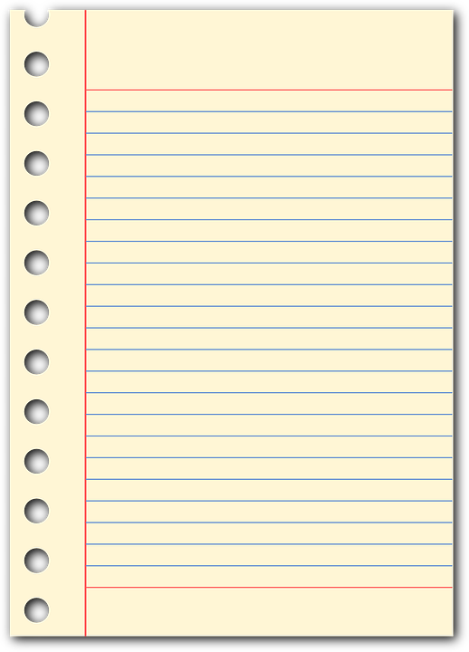

# TypeScript Todo App

### https://typescript-tod0.netlify.app/

## TypeScript Todo App

- This todo app was built with React and TypeScript
- Type in your task and how long it will take you to complete your task
- I used this as a practice exercise to learn more about TypeScript

 

 

## Usage

### `npm install`

### `npm start`

Runs the app in the development mode. 
Open [http://localhost:3000](http://localhost:3000)

### `npm run build`

Builds the app for production to the `build` folder. 
